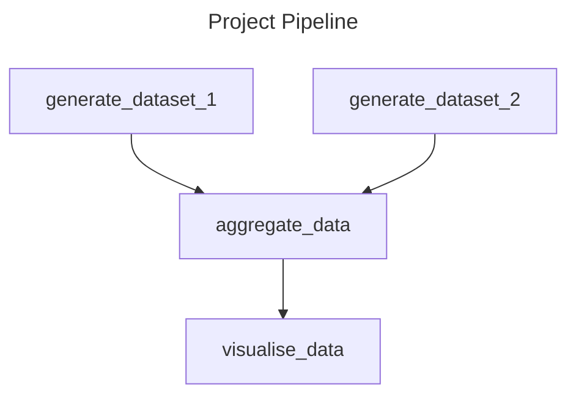

# project-dag

## Summary

This is the code and configuration for project-dag, a Python reusable action for the OpenSAFELY framework.

Given a project.yaml file, the action generates a [Mermaid](https://github.com/mermaid-js/mermaid#readme) diagram displaying a directed acyclic graph (DAG) of the actions within the file. This gives a visual representation of the discrete steps within your OpenSAFELY project. Below is an example.




# Usage

You can use this action to generate a Mermaid diagram by following these steps:

1. Prepare a YAML file that defines the actions and their dependencies:

```
actions:
  generate_dataset_1:
    run: ehrql:v1 generate-dataset analysis/dataset_definition.py --output output/dataset.csv.gz
    outputs:
      highly_sensitive:
        dataset: output/dataset.csv.gz
  
  generate_dataset_2:
    run: ehrql:v1 generate-dataset analysis/dataset_definition.py --output output/dataset.csv.gz
    outputs:
      highly_sensitive:
        dataset: output/dataset.csv.gz

  aggregate_data:
    run: python:v2 python analysis/aggregate.py
    needs: [generate_dataset_1, generate_dataset_2]
    outputs:
      moderately_sensitive:
        dataset: output/dataset_aggregated.csv.gz
```

2. Run the action::

```
generate_project_dag:
    run: python:v2 python analysis/project_dag.py --yaml-path project.yaml --output-path project.dag.md
    outputs:
      moderately_sensitive:
        counts: project.dag.md
```

There are two optional arguments:
- `--yaml-path` (default: `project.yaml`): The path to the YAML file that defines the actions and their dependencies.
- `--output-path` (default: `project.dag.md`): The path to the output file where the Mermaid diagram will be saved in markdown format.

3. The action will read the YAML file, generate a Mermaid diagram based on the defined actions and dependencies, and save it to the specified output file in markdown format.

4. Open the generated markdown file using a markdown viewer or editor to view and render the Mermaid diagram or add it to your README.